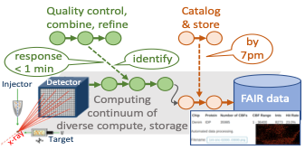
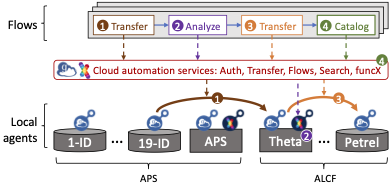

# Experiments Linked with Infrastructure, Simulation, and AI

Next-generation scientific instruments offer new means to understand and harness a broad range of phenomena. New methods are required to collect, analyze, store, and curate the often voluminous data that these instruments produce, and to enable timely feedback to experimenters and experimental facilities. Coupling with computational simulations and artificial intelligence (AI) methods are frequently also required.

To address these needs, we have developed a data architecture, Gladier, that enables the **rapid development of customized data capture, storage, and analysis solutions for experimental facilities**.
Deployments at Argonne’s Advanced Photon Source (APS) and Leadership Computing Facility (ALCF) has enabled a variety of such solutions, including:
delivery of data produced during tomographic experiments to remote collaborators;
capture, analysis, and cataloging of data from X-ray Photon Correlation Spectroscopy (XPCS) experiments; and
feedback based on analysis of data from serial synchrotron crystallography (SSX) experiments to guide data acquisition.
Gladier allows each of these and other applications to be structured as sets of **flows**, each of which can be authored separately and adapted for reuse in different settings.

## Gladier architecture

The Gladier architecture leverages a data/computing substrate based on **data and compute agents** deployed across computer and storage systems at APS, ALCF, and elsewhere, all managed by cloud-hosted Globus services.
All components are supported by the Globus Auth identity and access management platform to enable single sign on and secure interactions between components.
This substrate makes it easy for programmers to route data and compute requests to different storage systems and computers.
Other services support the definition and management of flows that coordinate data transfer, analysis, cataloging, and other activities associated with experimental activities.

<!--- Include mention of DM --->

## Example applications

## People

Ben Blaiszik

Kyle Chard

Ryan Chard

Ian Foster

Raj Kettimuthu

Zhengchun Liu

Bogdan Nicolae

Rafael Vescovi

Justin Wozniak

## Scientific papers

TBD.

## Support

This work is supported by the U.S. Department of Energy's Office of Advanced Scientific Computing Research, via the project **Braid: Data Flow Automation for Scalable and FAIR Science**, and Office of Basic Energy Science, via the project **Actionable Information from Sensor to Data Center**; the [Argonne Leadership Computing Facilty](https://alcf.anl.gov); the [Advanced Photon Source](https://aps.anl.gov); and Argonne LDRD funds. 
