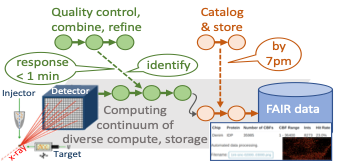
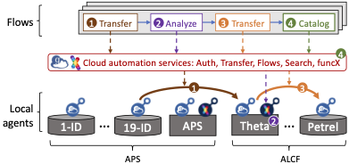

# Experiments Linked with Infrastructure, Simulation, and AI

Next-generation scientific instruments offer new means to understand and harness a broad range of phenomena. New methods are required to collect, analyze, store, and curate the often voluminous data that these instruments produce, and to enable timely feedback to experimenters and experimental facilities. Coupling with computational simulations and artificial intelligence (AI) methods are frequently also required.

To address these needs, we have developed a data architecture, Gladier, that enables the **rapid development of customized data capture, storage, and analysis solutions for experimental facilities**.
Deployments at Argonne’s Advanced Photon Source (APS) and Leadership Computing Facility (ALCF) involve a variety of such solutions, including:
delivery of data produced during tomographic experiments to remote collaborators;
capture, analysis, and cataloging of data from X-ray Photon Correlation Spectroscopy (XPCS) experiments; and
feedback based on analysis of data from serial synchrotron crystallography (SSX) experiments to guide data acquisition.
Gladier allows each of these and other applications to be structured as sets of **flows**, each of which can be authored separately and adapted for reuse in different settings.

## Gladier architecture

The Gladier architecture leverages a data/computing substrate based on **data and compute agents** deployed across computer and storage systems at APS, ALCF, and elsewhere, all managed by cloud-hosted Globus services.
All components are supported by the Globus Auth identity and access management platform to enable single sign on and secure interactions between components.
This substrate makes it easy for programmers to route data and compute requests to different storage systems and computers.
Other services support the definition and management of flows that coordinate data transfer, analysis, cataloging, and other activities associated with experimental activities. The figure shows (bottom) Globus Connect and FunConnect agents deployed on APS and ALCF storage systems (cylinders) and computers (rectangles); (middle) cloud automation services; and (top) a (simplified) example flow, which transfers data from the 19-1D beamline to Theta, an ALCF supercomputer; runs an analysis; moves data to Petrel; and catalogs results—with all four actions managed by the automation services. The numbers associate the flow actions with where they are instantiated in the system.

<!--- Include mention of DM --->

## Example applications

### Serial Synchrotron Crystallography (SSX)

Serial Synchrotron Crystallography (SSX) requires rapid data processing for the tens of thousands of images captured per hour. To meet these data processing needs we deployed a [Flows-based data acquisition, analysis, curation, and visualization pipeline](https://github.com/ANL-Braid/flows#synchrotron-serial-crystalography) (see figure), leveraging Theta for high-speed on-demand analysis. The pipeline reactively analyzes data as it is collected, moving images from the beamline to ALCF for analysis and visualization. The pipeline then moves results to a repository and extracts metadata for publication in a data portal, which scientists can monitor during an experiment. By generating and delivering statistics and images in near real-time, the Flow enables scientists to determine whether enough data have been collected for a sample, whether a second sample is needed to produce suitable statistics, or whether the sample is not producing enough data to warrant continued processing. [This paper](https://www.pnas.org/content/118/21/e2100170118) describes an application.

### High Energy Diffraction Microscopy (HEDM)

BraggNN is a machine learning-based method that can localize Bragg peaks in high energy diffraction microscopy images more than 200x faster than conventional methods.
Data collected at an experiment (at APS or SLAC) is combined with simulation data to train a sample-specific DNN model, which is then deployed to the experiment for fast processing, filtering, and quality control. These various components are incorporated into a Globus Flow that uses Globus to rapidly move data for training, funcX for simulation and model training, and Globus to move models to the edge. In the future, the flow will also use funcX for inference at the edge.
For more details, see [ArXiv2008.08198](https://arxiv.org/pdf/2008.08198.pdf). 
BraggNN is developed in the DOE BES project **Actionable Information from Sensor to Data Center**, in collaboration with SLAC.

### Ptychography

Ptychography is a non-invasive 2D imaging technique that is widely used at synchrotron light sources to study functional, structural, biological, and energy materials at extremely high spatial resolutions.
Asample is continuously raster-scanned using a focused X-ray beam and the corresponding diffraction patterns are acquired on a photon-counting pixelated detector. These diffraction patterns are then processed using an iterative ptychographic reconstruction method to generate 2D real-space projection images.
To enable rapid data analysis and feedback, we [define a Flow](https://github.com/ANL-Braid/flows#ptychography) that (see figure) transfers data from data acquisition machine (edge) to compute cluster (e.g., at ALCF); initiates reconstruction; and transfers reconstructed images back to light source. 
In the future, additional Flows will be added to index, catalog, and archive images.

### X-Ray Photon Correlation Spetroscopy

See [the Flow](https://github.com/ANL-Braid/flows#x-ray-photon-correlation-spetroscopy).

## Flows

Our work with the applications listed above and others are helping us to develop a library of canonical flows. We list some of these here.

1. Analyze data produced by instrument.
2. Train machine learning model based on data produced by instrument.
3. Extract metadata from data produced by instrument and add to repository and catalog.

## People

Work on this project involves numerous talented people at Argonne, the University of Chicago, and other institutions. We list here some of the major participants.

* Much of the work on developing new flows is performed by **Ryan Chard** and **Rafael Vescosci**.

* APS application development engages, among others, **Tekin Bicer**, **Raj Kettimuthu**, **Zhengchun Liu**, and **Aniket Tekawade**.

* The Braid project engages **Ben Blaiszik**, **Tekin Bicer**, **Kyle Chard**, **Ryan Chard**, **Ian Foster**, **Raj Kettimuthu**, **Zhengchun Liu**, **Bogdan Nicolae**, **Raf Vescovi**, and **Justin Wozniak**.

* The Globus Flows service that we use to coordinate activities is developed by team that includes **Rachana Ananthakrishnan** and **Jim Pruyne**.

* At ALCF, we work with **Mike Papka** and **Tom Uram**, among others.

* At APS, we benefit from the work, advice, and help of many, including: **Jon Almer**, **Francesco De Carlo**, **Andrzej Joachimiak**, **Suresh Narayanan**, **Nicholas Schwarz**, **Darren Sherrell**, and **Sinisa Veseli**.

## Scientific papers

High-performance ptychographic reconstruction with federated facilities, Tekin Bicer, Xiaodong Yu, Daniel J. Ching, Ryan Chard, Mathew J. Cherukara, Bogdan Nicolae, Rajkumar Kettimuthu, and Ian T.Foster, Smoky Mountains Conference, 2021

[BraggNN: Fast X-ray Bragg Peak Analysis Using Deep Learning](https://arxiv.org/abs/2008.08198), Zhengchun Liu, Hemant Sharma, Jun-Sang Park, Peter Kenesei, Antonino Miceli, Jonathan Almer, Rajkumar Kettimuthu, Ian Foster, [IUCrJ](https://journals.iucr.org/m/) (to appear). 

## Building blocks

**[Globus Flows](https://www.globus.org/platform/services/flows)** is a foundational service for defining and executing secure, reliable automated data flows at scale. We use it to implement many of the application pipelines used by Braid applications.

**[funcX](https://funcx.org)** is a distributed Function as a Service (FaaS) platform that enables flexible, scalable, and high performance remote function execution. We use it to invoke computational tasks from within Flows. 

**Gladier** is a developer-focused framework for creating Flows from common building blocks. We use it to author many of our Braid application Flows.

## Thanks!

This work is supported by the U.S. Department of Energy's Office of Advanced Scientific Computing Research, via the project **Braid: Data Flow Automation for Scalable and FAIR Science**, and Office of Basic Energy Science, via the project **Actionable Information from Sensor to Data Center**; the [Argonne Leadership Computing Facilty](https://alcf.anl.gov); the [Advanced Photon Source](https://aps.anl.gov); and Argonne LDRD funds. 

This page is accessible at [https://anl-braid.github.io/braid/](https://anl-braid.github.io/braid/).
