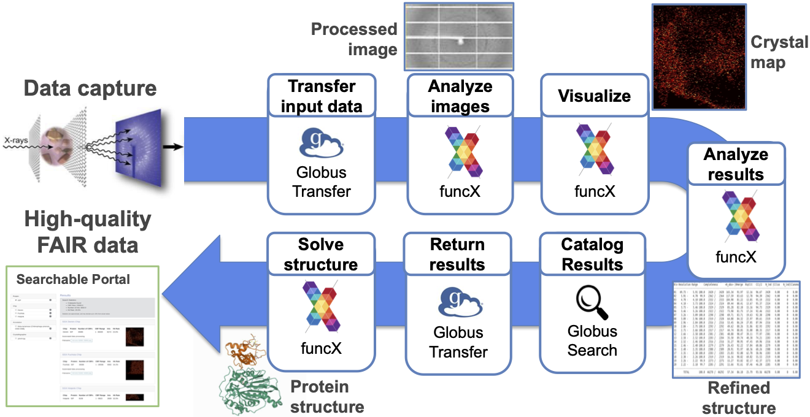

# Experiments Linked with Infrastructure, Simulation, and AI

Next-generation scientific instruments offer new means to understand and harness a broad range of phenomena. New methods are required to collect, analyze, store, and curate the often voluminous data that these instruments produce, and to enable timely feedback to experimenters and experimental facilities. Coupling with computational simulations and artificial intelligence (AI) methods are frequently also required.

To address these needs, we have developed a data architecture, Gladier, that enables the **rapid development of customized data capture, storage, and analysis solutions for experimental facilities**.
Deployments at Argonne’s Advanced Photon Source (APS) and Leadership Computing Facility (ALCF) has enabled a variety of such solutions, including:
delivery of data produced during tomographic experiments to remote collaborators;
capture, analysis, and cataloging of data from X-ray Photon Correlation Spectroscopy (XPCS) experiments; and
feedback based on analysis of data from serial synchrotron crystallography (SSX) experiments to guide data acquisition.
Gladier allows each of these and other applications to be structured as sets of **flows**, each of which can be authored separately and adapted for reuse in different settings.

## Gladier architecture

The Gladier architecture leverages a data/computing substrate based on **data and compute agents** deployed across computer and storage systems at APS, ALCF, and elsewhere, all managed by cloud-hosted Globus services.
All components are supported by the Globus Auth identity and access management platform to enable single sign on and secure interactions between components.
This substrate makes it easy for programmers to route data and compute requests to different storage systems and computers.
Other services support the definition and management of flows that coordinate data transfer, analysis, cataloging, and other activities associated with experimental activities. The figure shows (bottom) Globus Connect and FunConnect agents deployed on APS and ALCF storage systems (cylinders) and computers (rectangles); (middle) cloud automation services; and (top) a (simplified) example flow, which transfers data from the 19-1D beamline to Theta, an ALCF supercomputer; runs an analysis; moves data to Petrel; and catalogs results—with all four actions managed by the automation services. The numbers associate the flow actions with where they are instantiated in the system.

<!--- Include mention of DM --->

## Example applications

### Serial Synchrotron Crystallography (SSX)

Serial Synchrotron Crystallography (SSX) requires rapid data processing for the tens of thousands of images captured per hour. To meet these data processing needs we deployed a Globus Flows-based data acquisition, analysis, curation, and visualization pipeline (see figure), leveraging Theta for high-speed on-demand analysis. The pipeline reactively analyzes data as it is collected, moving images from the beamline to ALCF for analysis and visualization. The pipeline then moves results to a repository and extracts metadata for publication in a data portal, which scientists can monitor during an experiment. By generating and delivering statistics and images in near real-time, the Flow enables scientists to determine whether enough data have been collected for a sample, whether a second sample is needed to produce suitable statistics, or whether the sample is not producing enough data to warrant continued processing. [This paper](https://www.pnas.org/content/118/21/e2100170118) describes an application.

### High Energy Diffraction Microscopy (HEDM)

BraggNN is a machine learning-based method that can localize Bragg peaks in high energy diffraction microscopy images more than 200x faster than conventional methods.
Data collected at an experiment (at APS or SLAC) is combined with simulation data to train a sample-specific DNN model, which is then deployed to the experiment for fast processing, filtering, and quality control. These various components are incorporated into a Globus Flow that uses Globus to rapidly move data for training, funcX for simulation and model training, and Globus to move models to the edge. In the future, the flow will also use funcX for inference at the edge.
For more details, see [ArXiv2008.08198](https://arxiv.org/pdf/2008.08198.pdf). 
BraggNN is developed in the DOE BES project **Actionable Information from Sensor to Data Center**, in collaboration with SLAC.

### Ptychography

TBD

### Tomography

TBD

## People

- Rachana Ananthakrishnan

- Tekin Bicer

- Ben Blaiszik

- Kyle Chard

- Ryan Chard

- Ian Foster

- Raj Kettimuthu

- Zhengchun Liu

- Bogdan Nicolae

- Rafael Vescovi

- Justin Wozniak

## Scientific papers

TBD.

## Building blocks

Globus Flows 

funcX 

## Support

This work is supported by the U.S. Department of Energy's Office of Advanced Scientific Computing Research, via the project **Braid: Data Flow Automation for Scalable and FAIR Science**, and Office of Basic Energy Science, via the project **Actionable Information from Sensor to Data Center**; the [Argonne Leadership Computing Facilty](https://alcf.anl.gov); the [Advanced Photon Source](https://aps.anl.gov); and Argonne LDRD funds. 
