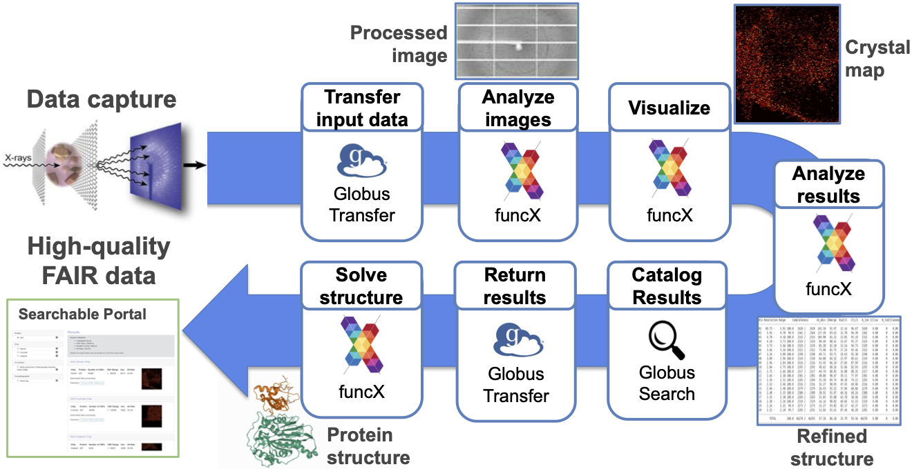
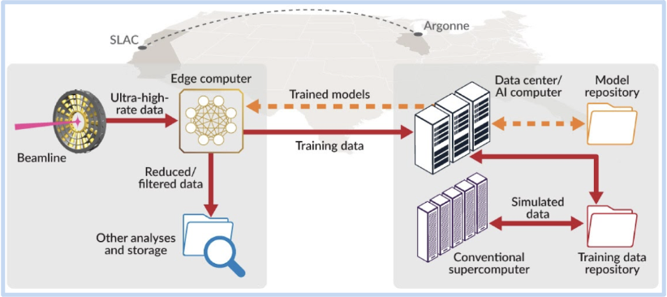
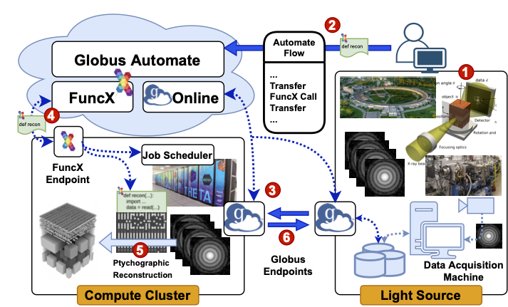

## Braid applications

A catalog of Braid applications and use cases. We provide the following information for each use case:

* A description of the application
* A high-level overview of the Flow(s) used to realize the application
* A link to the Flow implementation

Note: These Flows rely on specific endpoints that have been configured with environments for running the tools and require data to exist on certain Globus endpoints. 
Therefore, they are often not runnable without initial setup and configuration.

### Serial Synchrotron Crystallography (SSX)

Serial Synchrotron Crystallography (SSX) requires rapid data processing for the tens of thousands of images captured per hour. To meet these data processing needs we deployed a [Flows-based data acquisition, analysis, curation, and visualization pipeline](https://github.com/ANL-Braid/flows#synchrotron-serial-crystalography) (see figure), leveraging Theta for high-speed on-demand analysis. The pipeline reactively analyzes data as it is collected, moving images from the beamline to ALCF for analysis and visualization. The pipeline then moves results to a repository and extracts metadata for publication in a data portal, which scientists can monitor during an experiment. By generating and delivering statistics and images in near real-time, the Flow enables scientists to determine whether enough data have been collected for a sample, whether a second sample is needed to produce suitable statistics, or whether the sample is not producing enough data to warrant continued processing. [This paper](https://www.pnas.org/content/118/21/e2100170118) describes an application.

### High Energy Diffraction Microscopy (HEDM)

BraggNN is a machine learning-based method that can localize Bragg peaks in high energy diffraction microscopy images more than 200x faster than conventional methods.
Data collected at an experiment (at APS or SLAC) is combined with simulation data to train a sample-specific DNN model, which is then deployed to the experiment for fast processing, filtering, and quality control. These various components are incorporated into a [Flow](https://github.com/ANL-Braid/flows#high-energy-x-ray-diffraction-microscopy) that uses Globus to rapidly move data for training, funcX for simulation and model training, and Globus to move models to the edge. In the future, the flow will also use funcX for inference at the edge.
For more details, see [ArXiv2008.08198](https://arxiv.org/pdf/2008.08198.pdf).
BraggNN is developed in the DOE BES project **Actionable Information from Sensor to Data Center**, in collaboration with SLAC.

### Ptychography

Ptychography is a non-invasive 2D imaging technique that is widely used at synchrotron light sources to study functional, structural, biological, and energy materials at extremely high spatial resolutions.
Asample is continuously raster-scanned using a focused X-ray beam and the corresponding diffraction patterns are acquired on a photon-counting pixelated detector. These diffraction patterns are then processed using an iterative ptychographic reconstruction method to generate 2D real-space projection images.
To enable rapid data analysis and feedback, we [define a Flow](https://github.com/ANL-Braid/flows#ptychography) that (see figure) transfers data from data acquisition machine (edge) to compute cluster (e.g., at ALCF); initiates reconstruction; and transfers reconstructed images back to light source.
In the future, additional Flows will be added to index, catalog, and archive images.

### X-Ray Photon Correlation Spectroscopy (XPCS)

See [the Flow](https://github.com/ANL-Braid/flows#x-ray-photon-correlation-spetroscopy).
