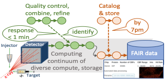
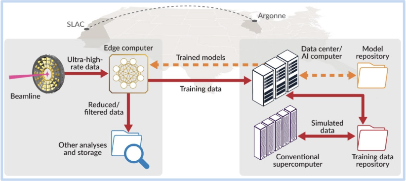

## Braid: Data Flow Automation for Scalable and FAIR Science

<!--  -->

Next-generation scientific instruments offer new means to understand and harness a broad range of physical and biological phenomena. However, the volume, velocity, and variety of data produced by these instruments challenge today’s often manual data collection, analysis, and curation methods. The result is missed scientific opportunities, both during experiments and later due to data not being rendered findable, accessible, interoperable, and reusable (FAIR). 

The Braid project aims to overcome these challenges by making it easy for researchers to define sets of **flows** that individually and collectively implement application capabilities while satisfying requirements for rapid response, high reconstruction fidelity, data enhancement, data preservation, model training, etc.
For example, a ptychography experiment that uses a machine learning (ML) model for rapid reconstruction may be structured as five distinct flows:

1. **Data capture**: Retrieve data from instrument, perform fast reconstruction with edge ML model, and stage results to temporary storage. 
2. **Analysis**: Process ML model results to derive additional quantities; 
3. **Indexing**: Extract and synthesize metadata, and load into catalog; 
4. **Reconstruction**: Move selected instrument data to HPC for full first-principles reconstruction. 
5. **Model training**: Use reconstructed data to (re)train the edge ML model.

- - - -


- - - -

As shown in the figure, we aim in Braid to enable such applications via advances in five areas: 

* T1: Design, develop, and apply methods for **authoring flows** that implement desired data management patterns, by combining modular and repurposable actions.
* T2: **Enforce policies** that researchers want flows to satisfy, concerning for example data capture, quality, and performance. 
* T3: **Make flows interpretable**, to understand progress and policy adherence, and to capture information required to meet FAIR standards. 
* T4: **Integrate flows with HPC** for such purposes as model training in response to new data collection.
* T5: Apply and evaluate these new methods in **driving science applications**.

<!-- It thus aims to enable scientific projects at DOE facilities to advance from today’s, largely manual, *collect now but analyze later* data analysis paradigm to a new *automated, AI-enhanced, self-documenting concurrent collect+analyze+feedback paradigm*. -->

<!-- Next-generation scientific instruments offer new means to understand and harness a broad range of phenomena. New methods are required to collect, analyze, store, and curate the often voluminous data that these instruments produce, and to enable timely feedback to experimenters and experimental facilities. Coupling with computational simulations and artificial intelligence (AI) methods is frequently also required. Methods and tools are then needed to support the authoring, execution, and management of the resulting data- and compute-intensive **Flows**. -->

Follow the links for more information on various elements of the project. 

* TOC
{:toc}

## Braid Architectural Model

Braid flows are intended to execute on a distributed infrastructure in which Globus-based services provide secure, reliable access to computing and storage resources; management of flows and other activities; and single sign on and secure interactions between components.


The figure illustrates the principal infrastructure elements.
Bottom: A **uniform data/computing substrate**, implemented by Globus Connect and funcX agents deployed on storage systems (cylinders) and computers (rectangles), makes it easy to direct data and compute requests to different storage systems and computers, such as at the Advanced Photon Source and Argonne Leadership Computing Facility, as shown here.
Middle: **Cloud automation services** support identity and access management (Globus Auth),
data transfer management (Globus Transfer), flow management (Globus Flows), catalogs (Globus Search), and computation management (funcX).

The top of the figure shows a simple flow that transfers data from the 19-1D beamline to Theta, an ALCF supercomputer; runs an analysis; transfers data to Petrel, an ALCF storage system; and ingests results—with all four actions managed by the automation services. The numbers associate the flow actions with where they are instantiated in the system.


## Braid Technical Plan

### Thrust 1: Author Flows 

We aim in Braid to make it easy to develop new applications by both **authoring new flows**, by composing reusable, atomic actions, and **reusing (and possibly adapting) existing flows**. 


Any flow, whether existing or new, is a sequence of **actions**, each involving an interaction with one or more elements of the Globus-based distributed infrastructure just described.
For example, the figure shows a flow in which, following sample preparation and data acquisition, five steps are performed: credentials are obtained from the user (Auth); data are transferred from the experimental facility to a computer system (Transfer); an analysis computation is performed on the computer system (funcX); metadata are obtained from a scientist (Describe); and data plus metadata are ingested into a searchable repository (Search).

We adopt [Globus Flows](https://www.globus.org/platform/services/flows) as the foundation on which we build flows. 
Globus Flows provides a robust hosted service to which clients can direct requests to create flows, run flows, and manage flow executions.
This foundation allows us to focus in Braid on: defining new actions required by our target applications; defining new flows, ideally in forms that permit easy adaptation and reuse; and, when and where necessary, extending the capabilities of the Globus Flows service and associated client tools.

One initial focus of our work is to create Python-based tooling to simplify flow authoring. 
The resulting Gladier library allows a developer to implement a flow by simply specifying the sequence of operations to be performed, with each action either being a Gladier-provided  standard action (denoted by a `glader_tools` prefer) or a user-defined action (e.g., here, `XPCS_analyze`).
User-defined actions invoke user-supplied Python code, making it easy for researchers to incorporate their existing tools into Flows.

```
xpcs_flow = [
        'gladier_tools.Transfer',
        'XPCS_analyze',
        'gladier_tools.Describe',
        'gladier_tools.Publish'
    ]
```

Gladier flows can be run as standalone Python programs or from Jupyter notebooks. They can  also be integrated with other submission systems, such as the [APS Data Management system](https://confluence.aps.anl.gov/display/DMGT/Infrastructure), which can start flows by calling the Gladier client.

### T2: Enforce Data Policies 

As illustrated above, a Braid application comprises one or more flows, each operating on supplied data and requiring the execution of specified actions. A particular application execution may be distinguished by the nature of the data provided, the resources available at the time of execution, and user-supplied parameters. 


### T3: Make Flows Interpretable 

### T4: Integrate Flows with HPC

### T5: Driving Science Applications

We are using Gladier to deploy a variety of such solutions at Argonne’s [Advanced Photon Source](https://aps.anl.gov) (APS) and [Leadership Computing Facility](https://alcf.anl.gov) (ALCF), [SLAC](https://www6.slac.stanford.edu), and elsewhere. The following are three example applications:

- delivery of data produced during tomographic experiments to remote collaborators;
- capture, analysis, and cataloging of data from X-ray Photon Correlation Spectroscopy (XPCS) experiments; and
- feedback based on analysis of data from serial synchrotron crystallography (SSX) experiments to guide data acquisition.


## Example Gladier applications

This simple example, runnable by anyone, involves a simple Flow that asks you to upload a photo that it then transforms and adds to a catalog.

The following Flows are all concerned with light source data analysis:

* [Acquisition, analysis, curation, and visualization of Serial Synchrotron Crystallography data](https://github.com/ANL-Braid/flows#synchrotron-serial-crystalography)
* [Localization of Bragg peaks in High Energy Diffraction Microscopy data](https://github.com/ANL-Braid/flows#high-energy-x-ray-diffraction-microscopy)

We provide brief summaries, plus pointers to more details, for several applications developed on the Gladier platform. 

### Serial Synchrotron Crystallography (SSX)


Serial Synchrotron Crystallography (SSX) requires rapid data processing for the tens of thousands of images captured per hour. To meet these data processing needs we deployed a [Flows-based data acquisition, analysis, curation, and visualization pipeline](https://github.com/ANL-Braid/flows#synchrotron-serial-crystalography) (see figure), leveraging Theta for high-speed on-demand analysis. The pipeline reactively analyzes data as it is collected, moving images from the beamline to ALCF for analysis and visualization. The pipeline then moves results to a repository and extracts metadata for publication in a data portal, which scientists can monitor during an experiment. By generating and delivering statistics and images in near real-time, the Flow enables scientists to determine whether enough data have been collected for a sample, whether a second sample is needed to produce suitable statistics, or whether the sample is not producing enough data to warrant continued processing. [This paper](https://www.pnas.org/content/118/21/e2100170118) describes an application.

### High Energy Diffraction Microscopy (HEDM)



BraggNN is a machine learning-based method that can localize Bragg peaks in high energy diffraction microscopy images more than 200x faster than conventional methods.
Data collected at an experiment (at APS or SLAC) is combined with simulation data to train a sample-specific DNN model, which is then deployed to the experiment for fast processing, filtering, and quality control. These various components are incorporated into a [Flow](https://github.com/ANL-Braid/flows#high-energy-x-ray-diffraction-microscopy) that uses Globus to rapidly move data for training, funcX for simulation and model training, and Globus to move models to the edge. In the future, the flow will also use funcX for inference at the edge.
For more details, see [ArXiv2008.08198](https://arxiv.org/pdf/2008.08198.pdf).
BraggNN is developed in the DOE BES project **Actionable Information from Sensor to Data Center**, in collaboration with SLAC.

### Ptychography


Ptychography is a non-invasive 2D imaging technique that is widely used at synchrotron light sources to study functional, structural, biological, and energy materials at extremely high spatial resolutions.
Asample is continuously raster-scanned using a focused X-ray beam and the corresponding diffraction patterns are acquired on a photon-counting pixelated detector. These diffraction patterns are then processed using an iterative ptychographic reconstruction method to generate 2D real-space projection images.
To enable rapid data analysis and feedback, we [define a Flow](https://github.com/ANL-Braid/flows#ptychography) that (see figure) transfers data from data acquisition machine (edge) to compute cluster (e.g., at ALCF); initiates reconstruction; and transfers reconstructed images back to light source.
In the future, additional Flows will be added to index, catalog, and archive images.


### X-Ray Photon Correlation Spectroscopy (XPCS)

See [the Flow](https://github.com/ANL-Braid/flows#x-ray-photon-correlation-spetroscopy).

## Flows

Our work with the applications listed above and others are helping us to develop a library of canonical flows. We list some of these here.

1. Analyze data produced by instrument.
2. Train machine learning model based on data produced by instrument.
3. Extract metadata from data produced by instrument and add to repository and catalog.

## People

Work on this project involves numerous talented people at Argonne, the University of Chicago, and other institutions. We list here some of the major participants.

* Much of the work on developing new flows is performed by **Ryan Chard** and **Rafael Vescovi** and **Nickolaus Saint**.

* APS application development engages, among others, **Tekin Bicer**, **Raj Kettimuthu**, **Zhengchun Liu**, and **Aniket Tekawade**.

* The Braid project engages **Ben Blaiszik**, **Tekin Bicer**, **Kyle Chard**, **Ryan Chard**, **Ian Foster**, **Raj Kettimuthu**, **Zhengchun Liu**, **Bogdan Nicolae**, **Rafael Vescovi**, and **Justin Wozniak**.

* The [Globus Flows service](https://www.globus.org/platform/services/flows) that we use to coordinate activities is developed by a team that includes **Rachana Ananthakrishnan** and **Jim Pruyne**, **Rudy Richter**, **Kurt McKee**, and **Uriel Mandujano**.

* At ALCF, we work with **Mike Papka** and **Tom Uram**, among others.

* At APS, we benefit from the work, advice, and help of many, including: **Jon Almer**, **Francesco De Carlo**, **Andrzej Joachimiak**, **Suresh Narayanan**, **Nicholas Schwarz**, **Darren Sherrell**, and **Sinisa Veseli**.


## Scientific papers

* [**High-performance ptychographic reconstruction with federated facilities**](https://arxiv.org/abs/2111.11330_, Tekin Bicer, Xiaodong Yu, Daniel J. Ching, Ryan Chard, Mathew J. Cherukara, Bogdan Nicolae, Rajkumar Kettimuthu, and Ian T.Foster, [Smoky Mountains Computational Science and Engineering Conference](https://smc2021.ornl.gov), 2021.

* [**Bridging data center AI Systems with edge computing for actionable information retrieval**](https://arxiv.org/abs/2105.13967), Zhengchun Liu, Ahsan Ali, Peter Kenesei, Antonino Miceli, Hemant Sharma,Nicholas Schwarz, Dennis Trujillo, Hyunseung Yoo, Ryan Coffee, Naoufal Layad,Jana Thayer, Ryan Herbst, Chunhong Yoon, Ian Foster, [3rd Annual Workshop on Extreme-Scale Experiment-in-the-Loop Computing](https://wordpress.cels.anl.gov/xloop-2021/about-xloop/), 2021. (Best paper award.)

* **[BraggNN: Fast X-ray Bragg peak analysis using deep learning](https://arxiv.org/abs/2008.08198)**, Zhengchun Liu, Hemant Sharma, Jun-Sang Park, Peter Kenesei, Antonino Miceli, Jonathan Almer, Rajkumar Kettimuthu, Ian Foster, [IUCrJ](https://journals.iucr.org/m/) (to appear).

## Building blocks

**[Globus Flows](https://www.globus.org/platform/services/flows)** is a foundational service for defining and executing secure, reliable automated data flows at scale. We use it to implement many of the application pipelines used by Braid applications.

**[funcX](https://funcx.org)** is a distributed Function as a Service (FaaS) platform that enables flexible, scalable, and high performance remote function execution. We use it to invoke computational tasks from within Flows.

**[Gladier](https://github.com/globus-gladier/gladier)** is a developer-focused framework for creating Flows from common building blocks. We use it to author many of our Braid application Flows.


## Thanks!

This work is supported by the U.S. Department of Energy's Office of Advanced Scientific Computing Research, via the project **Braid: Data Flow Automation for Scalable and FAIR Science**, and Office of Basic Energy Science, via the project **Actionable Information from Sensor to Data Center**; the [Argonne Leadership Computing Facilty](https://alcf.anl.gov); the [Advanced Photon Source](https://aps.anl.gov); and Argonne LDRD funds. Work on Globus Flows is supported by the National Science Foundation under award [1835890](https://www.nsf.gov/awardsearch/showAward?AWD_ID=1835890).

This page is accessible at [https://anl-braid.github.io/braid/](https://anl-braid.github.io/braid/) and editable in [this GitHub repository](https://github.com/ANL-Braid/braid/). 
